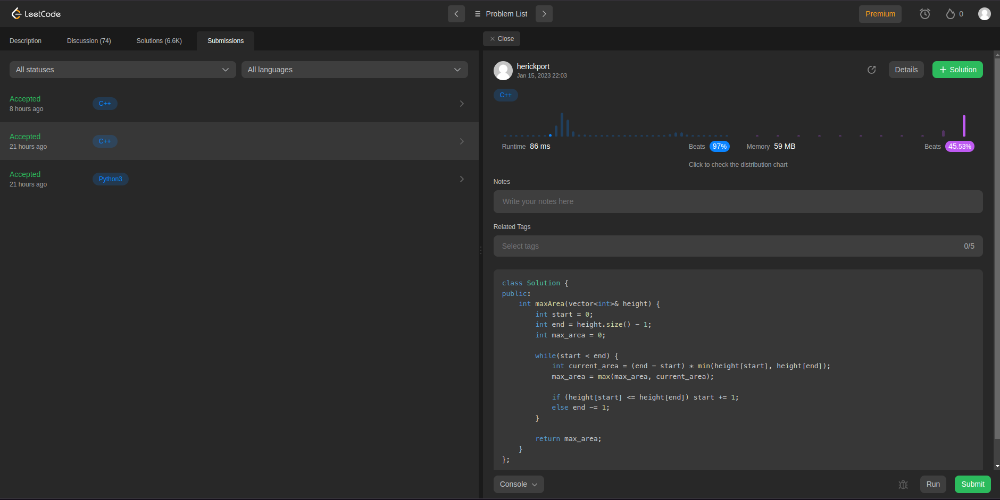

# Exercícios LeetCode

**Número da Lista**: 15 
**Conteúdo da Disciplina**: Algoritmos Ambiciosos 

## Alunos
| Matrícula  | Aluno                              |
| ---------- | ---------------------------------- |
| 18/0033034 | Hérick Ferreira de Souza Portugues |
| 18/0114093 | Lucas Ursulino Boaventura          |

## Sobre 
Os objetivos desse projeto, é praticar os conhecimentos adquiridos em sala de aula sobre o assunto **Algoritmos Ambiciosos**. Para isso, foram resolvidos alguns exercícios da Plataforma [LeetCode](https://leetcode.com/tag/greedy/), que já fornece alguns exercícios com a tag *Greedy*.

Os exercícios resolvidos foram:

- [55 - Jump Game](https://leetcode.com/problems/jump-game/)
- [45 - Jump Game II](https://leetcode.com/problems/jump-game-ii/)
- [122 - Best Time to Buy and Sell Stock II](https://leetcode.com/problems/best-time-to-buy-and-sell-stock-ii/)
- [11 - Container With Most Water](https://leetcode.com/problems/container-with-most-water/)
- [1561 - Maximum Number of Coins You Can Get](https://leetcode.com/problems/maximum-number-of-coins-you-can-get/)
- [455 - Assign Cookies](https://leetcode.com/problems/assign-cookies/)

Vídeo da apresentação está aqui: [Apresetnção](./assets/PA%20-%20Apresenta%C3%A7%C3%A3o%20-%20Greedy.mp4)

## Screenshots

## Instalação 
**Linguagem**: Python e C++ 

Não é necessário instalação

## Uso 

Para testar, basta acessar a questão pretendida (o link encontra-se no README) e submeter a solução correspondente armazenada na pasta `exercicios` (selecionando a linguagem de programação adequada).

